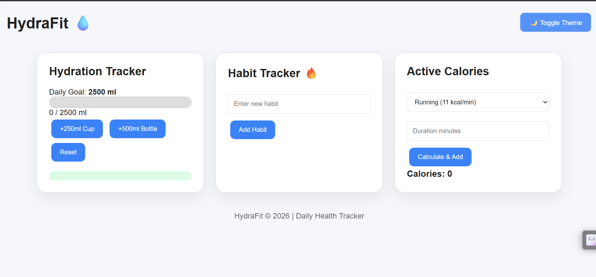
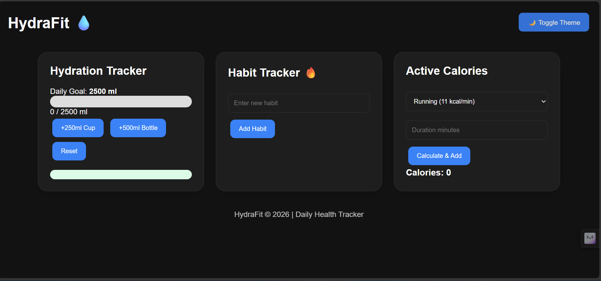

# 💧 HydraFit — Daily Health & Habit Tracker


## 📌 Overview

**HydraFit** is a responsive single-page health and habit tracking dashboard built completely from scratch using **Vanilla HTML, CSS, and JavaScript**.

The application helps users monitor three important daily wellness metrics:

* 💧 Daily water intake
* 🔥 Habit streak tracking
* ⚡ Active calorie burn

All user progress is stored locally using **Browser LocalStorage**, allowing data to remain available even after refreshing or reopening the application.

---

# 🚀 Features

## 💧 Hydration Tracker

Track your daily water consumption with a visual progress indicator.

Features:

* Daily hydration goal: **2500 ml**
* Add water quickly:

  * +250ml Cup
  * +500ml Bottle
* Reset water intake
* Dynamic progress bar
* Goal achievement detection
* Green completion indicator when target is reached
* Persistent water data using LocalStorage

---

## 🔥 Habit Streak Tracker

Manage daily habits and build consistency.

Features:

* Add new habits
* Maximum limit of 4 active habits
* Validation message when limit is exceeded
* Dynamic habit card generation
* Daily streak counter
* Log today's progress
* Delete unwanted habits
* Persistent habit storage

Example:

```
Exercise

🔥 Streak: 5

[Log Today] [Delete]
```

---

## ⚡ Active Calorie Calculator

Calculate calories burned from daily activities.

Supported activities:

| Activity   | Burn Rate   |
| ---------- | ----------- |
| 🏃 Running | 11 kcal/min |
| 🚴 Cycling | 8 kcal/min  |
| 🧘 Yoga    | 4 kcal/min  |

Formula:

```
Calories Burned = Duration × Activity Rate
```

Features:

* Activity selection
* Duration input
* Automatic calculation
* Daily calorie accumulation
* Saved calorie history

---

# 🌙 Dark / Light Mode

HydraFit includes a theme management system.

Features:

* Light mode
* Dark mode
* CSS variable based theme switching
* User preference saved in LocalStorage
* Theme remains after page refresh

---

# 📱 Responsive Design

The dashboard adapts to different screen sizes.

Desktop:

```
+-------------+-------------+-------------+
| Hydration   | Habit       | Calories    |
+-------------+-------------+-------------+
```

Mobile:

```
Hydration

Habit

Calories
```

Implemented using:

* CSS Grid
* Flexbox
* Media Queries

---

# 🛠️ Technologies Used

## Frontend

| Technology       | Purpose                       |
| ---------------- | ----------------------------- |
| HTML5            | Semantic structure            |
| CSS3             | Styling and responsive design |
| JavaScript ES6+  | Application logic             |
| LocalStorage API | Data persistence              |

---

# 📂 Project Structure

```
HydraFit/

│
├── index.html
│
├── style.css
│
├── script.js
│
└── README.md
```

---

# 🧠 JavaScript Concepts Implemented

This project demonstrates:

* DOM manipulation
* Event listeners
* Functions
* Variables and state management
* Arrays
* Objects
* Array methods
* Dynamic HTML creation
* JSON parsing/stringifying
* LocalStorage
* Conditional logic
* Input validation

---

# 🎨 CSS Concepts Implemented

* CSS Variables
* Theme management
* CSS Grid
* Flexbox
* Responsive layouts
* Media queries
* Transitions
* Animations
* Hover effects

---

# ▶️ How To Run The Project

### 1. Clone Repository

```bash
git clone https://github.com/mubasiranwar/HydraFit-Daily-Tracker.git
```

### 2. Open Project Folder

```bash
cd HydraFit
```

### 3. Run Application

Open:

```
index.html
```

in your browser.

No installation or dependencies are required.

---

# 📸 Application Preview


## Desktop Light Mode




## Desktop Dark Mode




---

# 🔮 Future Improvements

Possible future upgrades:

* User authentication
* Cloud database integration
* Backend API
* Health analytics dashboard
* Progress charts
* AI-based health recommendations
* Mobile application version
* Reminder notifications

---

# 🎯 Learning Outcome

Through HydraFit, I learned how to build a complete interactive frontend application using vanilla web technologies.

The project improved my understanding of:

* Creating responsive interfaces
* Managing application state
* Handling user interactions
* Persisting data
* Building reusable UI logic
* Thinking like a frontend developer

---

# 👨‍💻 Author

**Mubasir Anwar**

Computer Systems Engineer
AI & Web Development Enthusiast

---

# ⭐ If You Like This Project

Give it a star ⭐ and feel free to explore the code.
